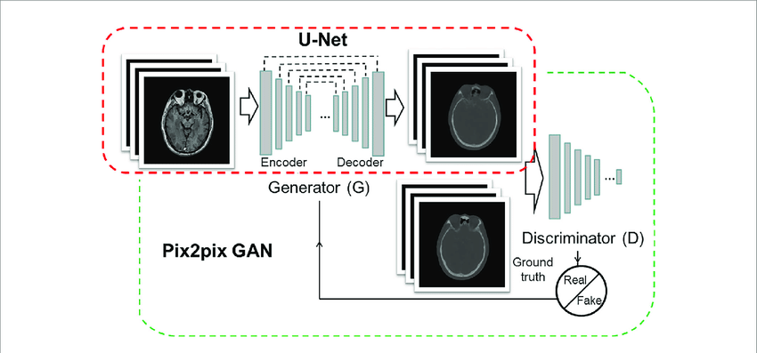
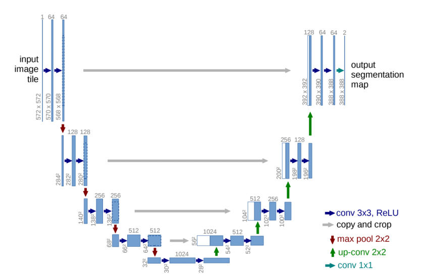

# Aerial-satellite-imagery-into-map-routes-using-Pix2Pix
Generative model based on the paper [*Image-to-Image Translation with Conditional Adversarial Networks*](https://arxiv.org/abs/1611.07004)
by Isola et al. 2017, also known as Pix2Pix. 
We will be training a model that can convert aerial satellite imagery ("input") into map routes ("output"), as was done in the original paper.

## Pix2Pix  architecture
The Pix2Pix GAN architecture involves the careful specification of a generator model, discriminator model, and model optimization procedure.
Both the generator and discriminator models use standard Convolution-BatchNormalization-ReLU blocks of layers as is common for deep convolutional
neural networks. Specific layer configurations are provided in the appendix of the paper.

## U-Net architecture

The architecture for the generator is a U-Net. You'll be able to see your model train starting from a pre-trained checkpoint - but feel free 
to train it from scratch on your own too. 

## PatchGAN Discriminator

Next, we will define a discriminator based on the contracting path of the U-Net to allow you to evaluate the realism of the generated images.
Remember that the discriminator outputs a one-channel matrix of classifications instead of a single value. Discriminator's final layer will 
simply map from the final number of hidden channels to a single prediction for every pixel of the layer before it.
